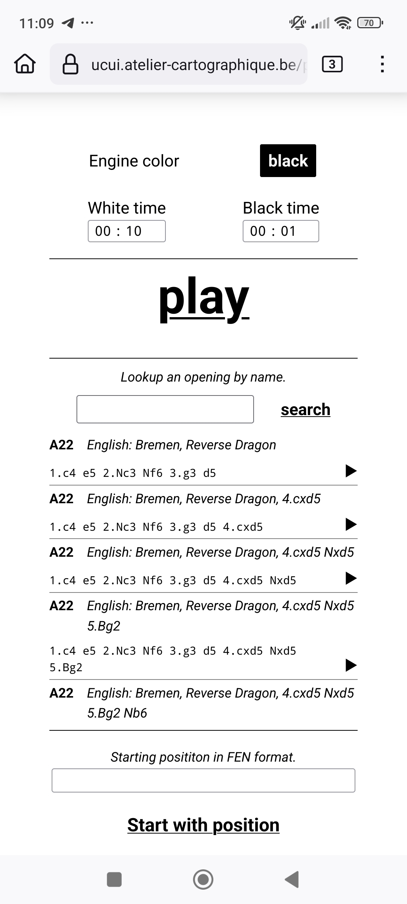
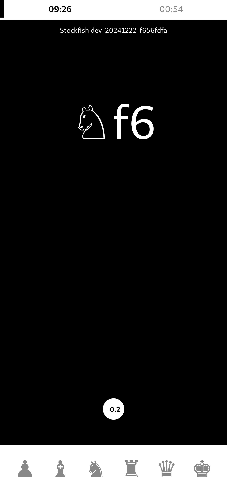
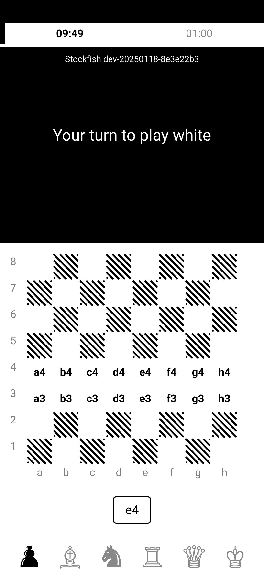
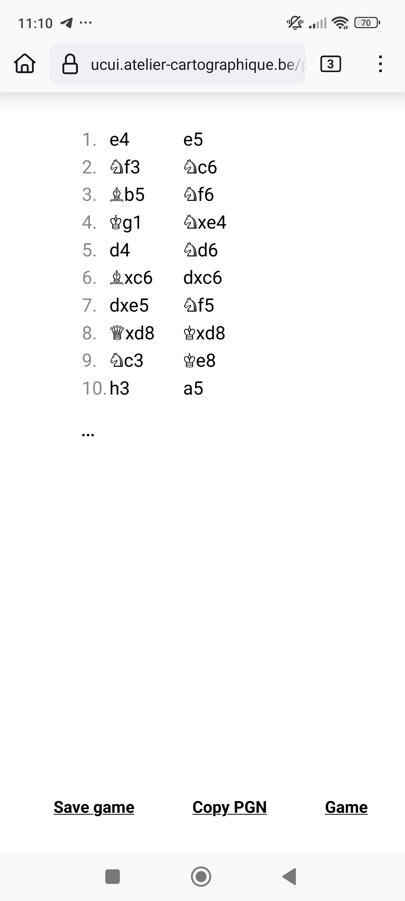
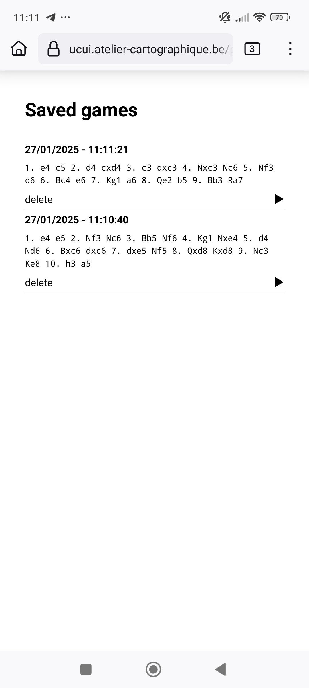

# µcui

A second attempt at providing a non-intrusive interface to play
against a chess engine.

What started as a [terminal application](./cli/README.md) proved to be fun, but failed to
provide the experience of playing undisturbed, because a laptop besides
a chessboard is way too massive an object.
This iteration of the experiment is a web application intended to run
on a smartphone next to the board.


Obviously, I got excited and started to pack the thing with features.
It's still very much a proof of concept, even though it's starting
to be fun to play with. To give it a try easily, I run an instance
of the main branch [there](https://ucui.atelier-cartographique.be)
that you can use and abuse.

## The client application

The [client](./clients/apps/play/) application is a basic [`typescript`](https://www.typescriptlang.org/)-written
piece of code bundled by [`vite`](https://vite.dev/), no dependencies so far.
I don't give build instructions yet because I move things around quite a lot
at this stage and it's not that I expect anyone to run it for now (atm, the
command from the `clients` directory is `npm run build-play`).

### Settings

[](./screenshots/settings.jpg)

### The engine made a move

[](./screenshots/engine.jpg)

### Your turn to make a move

[](./screenshots/input.jpg)

### The ongoing game

Yes, there's a mistake in the moves list, it's fixed :)

[](./screenshots/movelist.jpg)

### Saved games

[](./screenshots/history.jpg)

## The server

The server is a tiny (LOL) wrapper to interact with an ICU engine written
in [`rust`](https://www.rust-lang.org/). It's likely quite buggy but serves
well at supporting the experiment.

```
$ ucui-server --help
ucui server

Usage: ucui-server [OPTIONS] --engine <ENGINE>

Options:
  -i, --interface <INTERFACE>
          Interface to bind to

          [default: 0.0.0.0]

  -p, --port <PORT>
          Port to bind to

          [default: 8000]

  -s, --static-dir <DIR>
          Path to the static files directory

  -e, --engine <ENGINE>
          Path to a UCI engine

      --engine-args <ARGS>
          Optional arguments to pass to the engine (separated by ";")

          Example: --engine-args '--uci;--quiet'

      --uci-option <UCI_OPTION>
          UCI option

          This argument can be repeated. UCI options are of the form "ID[:VALUE]". VALUE can be missing if not needed (buttons). See the engine's documentation for available options and their default values.

          Example: --uci-option 'Threads:2' --uci-option 'Skill Level:12'

  -h, --help
          Print help (see a summary with '-h')

  -V, --version
          Print version

```

## License

This "work" is written by Pierre Marchand and licensed under the [GNU Affero General Public License](https://www.gnu.org/licenses/agpl-3.0.en.html) version 3.
