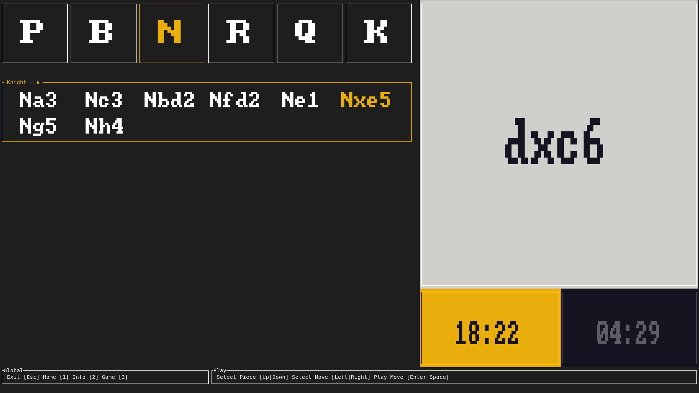

# ucui

A minimal UCI engine frontend experiment.

It's intended to be used as a least disruptive interface when playing over the board with a chess engine.

It's a work in progress. If you want to give it a try, you'll have to compile it from source. For this you'll need to [install `rust`](https://www.rust-lang.org/tools/install), clone or download this repository, then `cargo run --release -- --help` (release builds are very long to compile, but it happens only once) from the directory where the code ended up.

Note that it embeds the [blunders](https://github.com/paulolemus/blunders/) chess engine that is enough to test the interface. To play with a more advanced engine, you need to instruct `ucui` to do so, e.g.:

```
$ which stockfish
/usr/games/stockfish
$ cargo run --release -- --engine /usr/games/stockfish --white-time 1200 --black-time 300
```



```
Usage: ucui [OPTIONS]

Options:
  -e, --engine <ENGINE>
          Path to a UCI engine

  -w, --white-time <TIME>
          White time in seconds

          [default: 600]

  -b, --black-time <TIME>
          Black time in seconds

          [default: 600]

  -c, --engine-color <COLOR>
          set engine color

          [default: black]

          Possible values:
          - white: Engine takes white
          - black: Engine takes black

  -f, --fen <FEN>
          Optional starting position in FEN format

      --engine-args <ARGS>
          Optional arguments to pass to the engine (separated by ";")

          Example: --engine-args '--uci;--quiet'

      --log-level <LOG_LEVEL>
          set log level

          [default: info]

          Possible values:
          - off:   A level lower than all log levels
          - error: Corresponds to the `Error` log level
          - warn:  Corresponds to the `Warn` log level
          - info:  Corresponds to the `Info` log level
          - debug: Corresponds to the `Debug` log level
          - trace: Corresponds to the `Trace` log level

      --uci-option <UCI_OPTION>
          UCI option

          This argument can be repeated. UCI options are of the form KEY:VALUE. See the engine's documentation for available options and their default values.

          Example: --uci-option 'Threads:2' --uci-option 'Skill Level:12'

  -h, --help
          Print help (see a summary with '-h')

  -V, --version
          Print version

```
